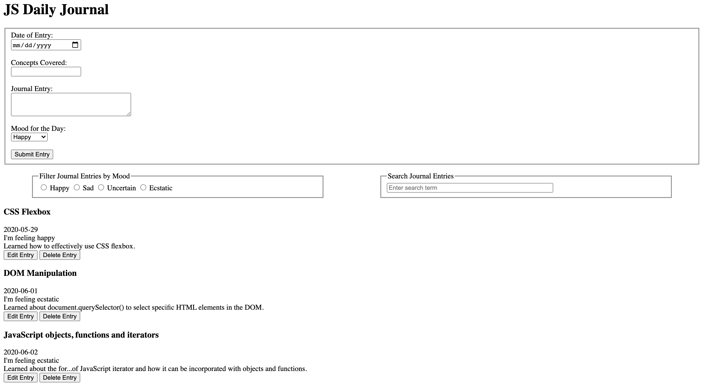

# Daily_Journal

A journal web application built using vanilla JavaScript, HTML, and CSS to enable students to document their progress in their learning journey.

## Usage

### View Entries

Journal entries are displayed under the filter and search boxes in list format and are sorted by the latest date appearing last (bottom). Each entry can be edited and deleted when the corresponding buttons are pressed.

### Add New Entry

Fill out Date, Concepts Covered, Journal Entry and Mood input fields in entry section and click on the Submit button to record a new entry.

### Filter Entries by Mood

Clicking on a corresponding mood radio button will display entries with that specific mood.

### Search Journal Entries

Search bar will automatically start searching for entries matching the user's key press

### Edit Entries

Click on the Edit button on the desired entry to populate that entry's data in the entry section allowing for user modification.

### Delete Entries

Click on the entry's Delete button to permanently remove the entry from the list.

## Learning Takeaways

- DOM manipulation with JavaScript
- Use of JavaScript objects, functions and iterators
- Building of REST API using JSON-Server
- Use of CSS Flexbox for structuring components on page
